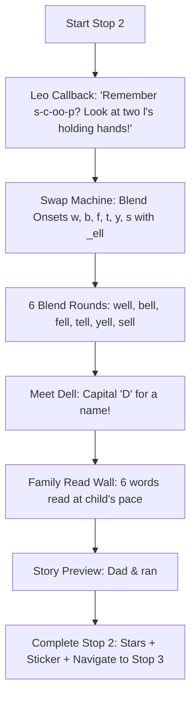

# Unit 10 Stop 2 — The -ell Family: Setup Guide

## 1. Overview & Pedagogical Purpose

* **Activity Name:** Stop 2 — The -ell Family (Unit 10 — Reading Peak)
* **Goal:** Pre-teach the `-ell` word family the story is built from, so nothing in the story stops the child cold.
* **Why it helps the child:** The well story leans almost entirely on `well`, `bell`, `fell`, `tell`, `yell`, `sell`, and the character name `Dell`. Meeting a double-l ending for the first time inside a story can break a child's confidence at the wrong moment. Two minutes of warm-up beforehand ensures the story reads itself!

---

## 2. Activity Flow



---

## 3. Unity UI & Hierarchy Setup

```text
Canvas (or Unit10_UIPanel)
└── Stop2_TheEllFamily [EllFamilyController]
    ├── TopBar
    │   ├── ProgressRing (Image - Type: Filled, Radial 360)
    │   ├── ProgressText (TextMeshProUGUI - "0%")
    │   └── StarMeter (RectTransform for scale bounce)
    │
    ├── LeoMascotContainer
    │   └── LeoMascot (Image / Mascot Animation)
    │
    ├── SwapMachinePanel (Phase 1: Blending Machine)
    │   ├── OnsetSlot (TMP: "w")
    │   ├── DoubleLSlot (TMP: "ell")
    │   ├── BlendedWordTMP (TMP: "well")
    │   ├── WordIllustration (Image)
    │   ├── BlendLeverButton (Button ➔ Blend)
    │   └── NextWordButton (Button + TMP "Next ➔")
    │
    ├── MeetDellPanel (Phase 2: Character Intro)
    │   ├── DellAvatar (Image)
    │   ├── DellTMP (TMP: "Dell")
    │   ├── DellPronounceButton (Button)
    │   └── NextToWallButton (Button + TMP "Read Family Wall ➔")
    │
    ├── FamilyWallPanel (Phase 3: Family Read Wall)
    │   ├── WordButtonsContainer (6 Buttons)
    │   │   ├── WallWord_0 (well) ... WallWord_5 (sell)
    │   └── FinishFamilyWallButton (Button + TMP "Ready for Story! ➔")
    │
    ├── DialogueUI
    │   ├── DialogueBubble (Image / CanvasGroup)
    │   └── DialogueTMP (TextMeshProUGUI)
    │
    ├── AudioSources
    │   ├── VoiceAudioSource (AudioSource - 2D, SpatialBlend: 0)
    │   └── SFXAudioSource (AudioSource - 2D, SpatialBlend: 0)
    │
    └── RewardsContainer
        ├── ConfettiParticles (ParticleSystem / UI Particle)
        ├── RewardPopup (GameObject)
        ├── StickerPopup (GameObject)
        └── ContinueButton (Button ➔ Advance to Stop 3)
```

---

## 4. Voice & Sound Script Manifest

| Asset Filename | Voice / Cue | Script / Transcript | Purpose & Context Note |
| :--- | :--- | :--- | :--- |
| `leo_u10s2_callback.wav` | **Leo** | *"Remember s-c-oo-p, when two letters held hands? Look — two l's, doing exactly the same thing!"* | Opening callback. |
| `leo_u10s2_blend_demo.wav` | **Leo** | *"w … e … ll. Well! The two l's make one sound."* | Blend demonstration. |
| `word_well.wav` | Word | *"well"* | Clear pronunciation. |
| `word_bell.wav` | Word | *"bell"* | Clear pronunciation. |
| `word_fell.wav` | Word | *"fell"* | Clear pronunciation. |
| `word_tell.wav` | Word | *"tell"* | Clear pronunciation. |
| `word_yell.wav` | Word | *"yell"* | Clear pronunciation. |
| `word_sell.wav` | Word | *"sell"* | Clear pronunciation. |
| `leo_u10s2_meet_dell.wav` | **Leo** | *"This is Dell. It is somebody's name, so it wears a big D — but it reads just like bell."* | Capital-letter explanation. |
| `leo_u10s2_wall_prompt.wav`| **Leo** | *"Read them all to me: well, bell, fell, tell, yell, sell."* | Family read prompt. |
| `leo_u10s2_bridge.wav` | **Leo** | *"Now you know every word in the story. Let us go and read it!"* | Bridge to Stop 3. |
