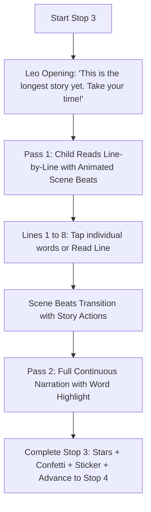

# Unit 10 Stop 3 — The Dog in the Well: Setup & Data Guide

## 1. Overview & Pedagogical Purpose

* **Activity Name:** Stop 3 — The Dog in the Well (Unit 10 — Reading Peak)
* **Goal:** Read the book's p. 47 story independently — the longest connected text in the course.
* **Why it helps the child:** This story features a problem and a solution: the dog falls in, Dell rings the bell, Dell yells, Dad runs, and Dad gets the dog out. Following this narrative sequence transitions the child from decoding to genuine independent reading.

---

## 2. Activity Flow



---

## 3. Quick One-Click Asset Generation

You can automatically generate and populate the complete data asset using Unity's top menu bar:

> **Unity Menu:** `EngSnap > Phonics2 > Create Dog In The Well Data (Unit 10 Stop 3)`

This generates the initialized `.asset` file at both:
1. **Runtime Resources Path:** `Assets/Resources/Phonics2/Unit10/DogInTheWellData_Unit10.asset`
2. **Project Asset Path:** `Assets/ScriptableObj/Phonics 2/Unit 10/The Dog In The Well/DogInTheWellData_Unit10.asset`

*(Note: `DogInTheWellController` automatically falls back to `Resources.Load<DogInTheWellData>("Phonics2/Unit10/DogInTheWellData_Unit10")` if left unassigned.)*

---

## 4. Section-by-Section Data Configuration

### A. 8 Book Story Lines Breakdown (`storyLines`)

| Line # | `lineText` | `wordTokens` | `animationBeatIndex` | Visual Scene Beat | Audio Clip |
| :---: | :--- | :--- | :---: | :--- | :--- |
| **`[0]`** | `"The well."` | `["The", "well."]` | `0` | Beat 0: Old stone well on quiet meadow. | `well_story_line_1.wav` |
| **`[1]`** | `"The bell."` | `["The", "bell."]` | `0` | Beat 0: Brass bell hanging beside the well. | `well_story_line_2.wav` |
| **`[2]`** | `"The dog fell in the well."` | `["The", "dog", "fell", "in", "the", "well."]` | `1` | Beat 1: Splash! Dog slips into the well. | `well_story_line_3.wav` |
| **`[3]`** | `"Dell, tell Dad the dog fell in the well."` | `["Dell,", "tell", "Dad", "the", "dog", "fell", "in", "the", "well."]` | `2` | Beat 2: Dell appears by the well. | `well_story_line_4.wav` |
| **`[4]`** | `"Dell rang the bell to tell Dad the dog fell."` | `["Dell", "rang", "the", "bell", "to", "tell", "Dad", "the", "dog", "fell."]` | `2` | Beat 2: Dell pulls rope & rings bell vigorously. | `well_story_line_5.wav` |
| **`[5]`** | `"Dell had to yell, \"The dog is in the well.\""` | `["Dell", "had", "to", "yell,", "\"The", "dog", "is", "in", "the", "well.\"" ]` | `3` | Beat 3: Dell hands to mouth, yelling for Dad. | `well_story_line_6.wav` |
| **`[6]`** | `"Dad ran to Dell at the well."` | `["Dad", "ran", "to", "Dell", "at", "the", "well."]` | `4` | Beat 4: Dad sprinting across meadow to well. | `well_story_line_7.wav` |
| **`[7]`** | `"Dad got the dog out of the well."` | `["Dad", "got", "the", "dog", "out", "of", "the", "well."]` | `5` | Beat 5: Dad lifts safe, wet puppy out of well! | `well_story_line_8.wav` |

---

### B. Story Scene Beat Animation Sprites (`storySceneBeatSprites`)

| Index | Scene Beat Sprite | Context & Narrative Beat | Accompanying SFX |
| :---: | :--- | :--- | :--- |
| **`[0]`** | `well_scene_idle.png` | Idle scene: Calm stone well with bell. | Ambient bird chirp / breeze |
| **`[1]`** | `well_scene_dog_falls.png` | Dog slips and falls into the well with splash. | `splashSfx` + `dogBarkSfx` |
| **`[2]`** | `well_scene_dell_rings_bell.png` | Dell rings the brass warning bell. | `bellRingSfx` |
| **`[3]`** | `well_scene_dell_yells.png` | Dell shouting towards the cottage. | Dell voice cue |
| **`[4]`** | `well_scene_dad_runs.png` | Dad running quickly to the well. | `dadRunningSfx` |
| **`[5]`** | `well_scene_rescued.png` | Dad lifts dog out; happy celebration! | `rescueCheerSfx` |

---

## 5. Voice & SFX Audio Script Manifest

| Asset Filename / Field | Voice / Source | Script / Transcript | Purpose & Context Note |
| :--- | :--- | :--- | :--- |
| **`openingIntroClip`** | **Leo** | *"This is the longest story yet. You know every word in it. Take your time — I will be quiet."* | Warm opening reassurance. |
| **`midStoryPraiseClip`** | **Leo** | *"You read that whole line by yourself."* | Quiet mid-story encouragement. |
| **`endingCelebrationClip`**| **Leo** | *"The dog is out! You read the whole story!"* | Climax celebration when dog is saved. |
| **`fullStoryNarrationClip`**| Story Narrator | *(Continuous, smooth 8-line reading with natural cadence)* | Model fluency second pass. |
| **`dogBarkSfx`** | SFX | *(Dog yip / bark)* | Dog in well audio. |
| **`bellRingSfx`** | SFX | *(Resonant brass bell chime)* | Dell ringing the well bell. |
| **`splashSfx`** | SFX | *(Water splash)* | Dog falling into well. |
| **`dadRunningSfx`** | SFX | *(Rapid footsteps on grass)* | Dad rushing to the well. |
| **`rescueCheerSfx`** | SFX | *(Joyful cheer & tail wag sound)* | Dog rescued safely. |
| **`lineCompleteTickSfx`**| SFX | *(Crisp green tick pop)* | Line completed confirmation. |
| **`correctChimeSfx`** | SFX | *(Bright success chime)* | Stage completion chime. |

---

## 6. Unity UI & Hierarchy Setup

To generate the hierarchy automatically in the active scene:
> **Unity Menu:** `EngSnap > Phonics2 > Unit 10 > Build Stop 3 (The Dog in the Well) Hierarchy in Active Scene`

```text
Canvas (or Unit10_UIPanel)
└── Stop3_TheDogInTheWell [DogInTheWellController, CanvasGroup]
    ├── Background (Image: Soft Meadow / Countryside, Stretch All)
    │
    ├── TopBar
    │   ├── ProgressRing (Image: Type=Filled, Radial 360)
    │   ├── ProgressText (TextMeshProUGUI: "0%")
    │   └── StarMeter (RectTransform for scale bounce)
    │
    ├── LeoMascotContainer
    │   └── LeoMascot (Image / Mascot Animation)
    │
    ├── StoryPanel (Phase 1 & 2: Story Reading Container)
    │   ├── WellSceneImage (Image - Animates through 6 story beats)
    │   ├── LineReadingArea (RectTransform: PosY: -130)
    │   │   ├── CurrentLineTMP (TextMeshProUGUI: "The dog fell in the well.")
    │   │   └── WordsContainer (HorizontalLayoutGroup - 12 Word Slots)
    │   │       ├── Word_0 ... Word_11 (Button + TMP + Highlight Image)
    │   ├── ReadLineHelpButton (Button + Speaker Icon 🔊)
    │   └── NextLineTickButton (Button + Green Checkmark ✔)
    │
    ├── DialogueUI
    │   ├── DialogueBubble (Image / CanvasGroup)
    │   └── DialogueTMP (TextMeshProUGUI)
    │
    ├── AudioSources
    │   ├── VoiceAudioSource (AudioSource - 2D, SpatialBlend: 0)
    │   └── SFXAudioSource (AudioSource - 2D, SpatialBlend: 0)
    │
    └── RewardsContainer
        ├── ConfettiParticles (ParticleSystem / UI Particle)
        ├── RewardPopup (GameObject)
        ├── StickerPopup (GameObject)
        └── ContinueButton (Button ➔ Advance to Stop 4)
```

---

## 7. Inspector Wire-Up Table (`DogInTheWellController`)

| Serialized Field | Reference Target |
| :--- | :--- |
| **Unit ID** | `"Unit10"` |
| **Topic Name** | `"TheDogInTheWell"` |
| **Activity Data** | `DogInTheWellData_Unit10` |
| **Voice Audio Source** | `AudioSources/VoiceAudioSource` |
| **SFX Audio Source** | `AudioSources/SFXAudioSource` |
| **Dialogue Text & Group** | `DialogueUI/DialogueTMP`, `DialogueUI` |
| **Story Panel & Scene Image** | `StoryPanel`, `StoryPanel/WellSceneImage` |
| **Current Line TMP** | `StoryPanel/LineReadingArea/CurrentLineTMP` |
| **Word Buttons In Line `[0..11]`**| `Word_0` .. `Word_11` |
| **Word Texts In Line `[0..11]`** | `Word_0/Text` .. `Word_11/Text` |
| **Word Highlights `[0..11]`** | `Word_0/Highlight` .. `Word_11/Highlight` |
| **Read Line Help & Next Buttons**| `ReadLineHelpButton`, `NextLineTickButton` |
| **Progress Ring & Star Meter** | `TopBar/ProgressRing`, `TopBar/StarMeter` |
| **Leo Mascot Object** | `LeoMascotContainer/LeoMascot` |
| **Confetti Particles** | `RewardsContainer/ConfettiParticles` |
| **Reward Popup** | `RewardsContainer/RewardPopup` |
| **Sticker Popup** | `RewardsContainer/StickerPopup` |
| **Continue Button** | `RewardsContainer/ContinueButton` |
| **Next Panel** | `Stop4_QuestionsAndGraduation` |
| **Current Panel** | `Stop3_TheDogInTheWell` |
