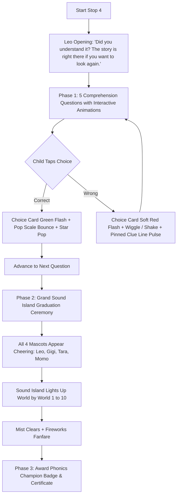
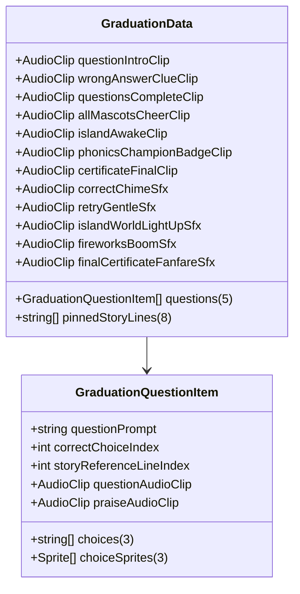

# Unit 10 Stop 4 — Questions & Grand Sound Island Graduation: Setup & Data Guide

## 1. Overview & Pedagogical Purpose

* **Activity Name:** Stop 4 — Questions + Graduation (Unit 10 — Reading Peak)
* **Goal:** The book's five comprehension questions (p. 47) answered by tapping — followed by the Grand Graduation ceremony that lights up all 10 worlds of Sound Island and awards the **"Phonics Champion"** badge and printable Certificate.
* **Why it helps the child:** Comprehension is what reading is for. Answering by tapping keeps the thinking intact for a pre-writer. Wrong answers trigger a gentle wiggle shake with soft red feedback and highlight the exact line in the pinned story text with a subtle bounce so mistakes become an empowering opportunity to re-read and discover. The graduation honors the overarching quest: Sound Island has its sounds back!

---

## 2. Activity Flow & Animations



### Visual & Interactive Feedback:
1. **Wrong Answer Animation**:
   * **Button Wiggle / Horizontal Shake:** Fast decay sinusoidal shake (`Mathf.Sin(elapsed * 45f) * 15f`) and slight rotation wiggle.
   * **Soft Red Flash:** Background card tints soft red (`#FFB4B4`) and fades back to normal.
   * **Pinned Story Clue Pulse:** The reference line containing the answer lights up yellow and bounces (`1.12x` scale pulse).
2. **Correct Answer Animation**:
   * **Joyful Pop Bounce:** Scales up to `1.18x` with smooth bounce.
   * **Bright Green Flash:** Background card tints light green (`#C8E6C9`) before advancing.
   * **Star Pop & Chime:** Top bar stars sparkle and chime.

---

## 3. Quick One-Click Asset Generation

You can automatically generate and populate the complete data asset using Unity's top menu bar:

> **Unity Menu:** `EngSnap > Phonics2 > Create Graduation Data (Unit 10 Stop 4)`

This generates the initialized `.asset` file at both:
1. **Runtime Resources Path:** `Assets/Resources/Phonics2/Unit10/GraduationData_Unit10.asset`
2. **Project Asset Path:** `Assets/ScriptableObj/Phonics 2/Unit 10/Graduation/GraduationData_Unit10.asset`

*(Note: `GraduationController` automatically falls back to `Resources.Load<GraduationData>("Phonics2/Unit10/GraduationData_Unit10")` if left unassigned.)*

---

## 4. Data Schema Architecture



---

## 5. Section-by-Section Data Configuration

### A. 5 Book Comprehension Questions (`questions`)

| # | Question Prompt (`questionPrompt`) | Choices (`choices`) | Correct Index | Story Reference Line | Clue / Text Evidence |
| :-: | :--- | :--- | :---: | :---: | :--- |
| **`[0]`** | *"Who rang the bell?"* | `["Dell", "Dad", "the dog"]` | `0` (`Dell`) | Line 4 (`[4]`) | *"Dell rang the bell to tell Dad the dog fell."* |
| **`[1]`** | *"Who fell in the well?"* | `["the dog", "Dell", "Dad"]` | `0` (`the dog`) | Line 2 (`[2]`) | *"The dog fell in the well."* |
| **`[2]`** | *"What did Dell do first to get help?"* | `["rang the bell", "yelled", "ran to Dad"]` | `0` (`rang the bell`) | Line 4 (`[4]`) | *"Dell rang the bell to tell Dad the dog fell."* |
| **`[3]`** | *"Who did Dell tell?"* | `["Dad", "the dog", "the hen"]` | `0` (`Dad`) | Line 3 (`[3]`) | *"Dell, tell Dad the dog fell in the well."* |
| **`[4]`** | *"What did Dad do?"* | `["got the dog out", "rang the bell", "fell in the well"]` | `0` (`got the dog out`) | Line 7 (`[7]`) | *"Dad got the dog out of the well."* |

---

### B. 8 Pinned Story Lines (`pinnedStoryLines`)

The 8 story lines stay pinned in the top half of the screen during the quiz. If the child answers incorrectly, the exact reference line highlights in yellow so they can re-read and discover the answer:

| Line Index | Pinned Story Text | Answers Question # |
| :---: | :--- | :---: |
| `[0]` | `The well.` | — |
| `[1]` | `The bell.` | — |
| `[2]` | `The dog fell in the well.` | **Q2** |
| `[3]` | `Dell, tell Dad the dog fell in the well.` | **Q4** |
| `[4]` | `Dell rang the bell to tell Dad the dog fell.` | **Q1, Q3** |
| `[5]` | `Dell had to yell, "The dog is in the well."` | — |
| `[6]` | `Dad ran to Dell at the well.` | — |
| `[7]` | `Dad got the dog out of the well.` | **Q5** |

---

### C. Sound Island Graduation Assets

| Asset / UI Component | Role in Graduation | Trigger / Timing |
| :--- | :--- | :--- |
| **`islandWorldGlowImages[0..9]`** | 10 World Glows on Sound Island map | Lights up in rapid succession (Worlds 1 to 10) |
| **`allFourMascotsContainer`** | Leo, Gigi, Tara, and Momo together | Appear jumping and cheering: *"Hooray! Hooray!"* |
| **`fireworksParticleSystem`** | Sky fireworks celebration | Fires bursts across the screen |
| **`phonicsChampionBadgePopup`** | Golden Phonics Champion Badge modal | *"You started by listening. Now you can read!"* |
| **`certificateModalPopup`** | Printable Graduation Certificate | Shows Child Name (`"Star Reader"`) & Word Count (`"100+ Words Mastered"`) |

---

## 6. Voice & SFX Audio Script Manifest

| Field / Asset Filename | Voice / Source | Script / Transcript | Purpose & Context Note |
| :--- | :--- | :--- | :--- |
| **`questionIntroClip`** | **Leo** | *"Now — did you understand it? The story is right there if you want to look again."* | Opening reassurance. Explicitly permits re-reading. |
| **`wrongAnswerClueClip`** | **Leo** | *"Let us look again — the answer is hiding in this line."* | Gentle correction clue with line highlight. |
| **`questionsCompleteClip`** | **Leo** | *"Five out of five. You read it AND you understood it."* | Completion of questions phase. |
| **`allMascotsCheerClip`** | **All 4 Mascots**| *"Hooray! Hooray!"* | All 4 mascots cheering in unison. |
| **`islandAwakeClip`** | **Leo** | *"Look at the island! Every sound is home. YOU woke up Sound Island."* | The grand Unit 1 promise fulfilled. |
| **`phonicsChampionBadgeClip`**| **Leo** | *"You started by listening. Now you can read. You are a PHONICS CHAMPION!"* | Badge award audio. |
| **`certificateFinalClip`** | **Leo** | *"Here is your certificate. Show somebody — and then let us read a story again, just for fun."* | Final certificate presentation. |
| **`correctChimeSfx`** | SFX | *(Bright success chime)* | Question answered correctly. |
| **`retryGentleSfx`** | SFX | *(Soft retry note)* | Gentle wrong answer feedback. |
| **`islandWorldLightUpSfx`** | SFX | *(Magical chime sweep)* | Plays as Sound Island worlds glow 1 to 10. |
| **`fireworksBoomSfx`** | SFX | *(Celebratory fireworks explosion)*| Graduation finale fireworks sound. |
| **`finalCertificateFanfareSfx`**| SFX | *(Grand orchestral fanfare)* | Grand culmination fanfare. |

---

## 7. Unity UI & Hierarchy Setup

To generate the hierarchy automatically in the active scene:
> **Unity Menu:** `EngSnap > Phonics2 > Unit 10 > Build Stop 4 (Questions & Graduation) Hierarchy in Active Scene`

```text
Canvas (or Unit10_UIPanel)
└── Stop4_QuestionsAndGraduation [GraduationController, CanvasGroup]
    ├── Background (Image: Grand Horizon / Island sky, Stretch All)
    │
    ├── TopBar
    │   ├── ProgressRing (Image: Type=Filled, Radial 360)
    │   ├── ProgressText (TextMeshProUGUI: "0%")
    │   └── StarMeter (RectTransform for scale bounce)
    │
    ├── QuestionsPanel (Phase 1: Pinned Story & Questions Container)
    │   ├── PinnedStoryPanel (Top Half of Screen)
    │   │   ├── StoryTitleTMP ("The Dog in the Well")
    │   │   └── StoryLinesContainer (VerticalLayoutGroup - 8 Lines)
    │   │       ├── Line_0 ... Line_7 (TMP_Text + LineHighlight Image)
    │   └── QuestionArea (Bottom Half of Screen)
    │       ├── QuestionPromptTMP (TextMeshProUGUI: "Who rang the bell?")
    │       └── ChoicesContainer (HorizontalLayoutGroup - 3 Choice Cards)
    │           ├── Choice_0 (Button + ChoiceImage + ChoiceTMP)
    │           ├── Choice_1 (Button + ChoiceImage + ChoiceTMP)
    │           └── Choice_2 (Button + ChoiceImage + ChoiceTMP)
    │
    ├── GraduationPanel (Phase 2: Sound Island Finale, Inactive initially)
    │   ├── SoundIslandMapBackground (Image - Island Map)
    │   ├── WorldGlowNodes (10 Image Glows: World 1 to 10)
    │   ├── AllFourMascotsContainer
    │   │   ├── LeoMascot (Image)
    │   │   ├── GigiMascot (Image)
    │   │   ├── TaraMascot (Image)
    │   │   └── MomoMascot (Image)
    │   └── FireworksParticleSystem (ParticleSystem / UI Particle)
    │
    ├── ModalsContainer (Phase 3: Badge & Certificate Modals)
    │   ├── PhonicsChampionBadgePopup (Golden Badge Modal)
    │   ├── CertificateModalPopup (Printable Certificate Card)
    │   │   ├── ChildNameTMP ("Star Reader")
    │   │   └── WordCountTMP ("100+ Words Mastered")
    │   └── FinishGameButton (Button + TMP "Finish Course ➔")
    │
    ├── DialogueUI
    │   ├── DialogueBubble (Image / CanvasGroup)
    │   └── DialogueTMP (TextMeshProUGUI)
    │
    ├── AudioSources
    │   ├── VoiceAudioSource (AudioSource - 2D, SpatialBlend: 0)
    │   └── SFXAudioSource (AudioSource - 2D, SpatialBlend: 0)
    │
    └── RewardsContainer
        ├── ConfettiParticles (ParticleSystem / UI Particle)
        ├── RewardPopup (GameObject)
        ├── StickerPopup (GameObject)
        └── ContinueButton (Button)
```

---

## 8. Inspector Wire-Up Table (`GraduationController`)

| Serialized Field | Reference Target |
| :--- | :--- |
| **Unit ID** | `"Unit10"` |
| **Topic Name** | `"Graduation"` |
| **Activity Data** | `GraduationData_Unit10` |
| **Voice Audio Source** | `AudioSources/VoiceAudioSource` |
| **SFX Audio Source** | `AudioSources/SFXAudioSource` |
| **Dialogue Text & Group** | `DialogueUI/DialogueTMP`, `DialogueUI` |
| **Questions Panel** | `QuestionsPanel` |
| **Pinned Story Panel** | `QuestionsPanel/PinnedStoryPanel` |
| **Pinned Story Line Texts `[0..7]`**| `Line_0/Text` .. `Line_7/Text` |
| **Pinned Story Highlights `[0..7]`**| `Line_0/Highlight` .. `Line_7/Highlight` |
| **Question Prompt TMP** | `QuestionsPanel/QuestionArea/QuestionPromptTMP` |
| **Question Choice Buttons `[0..2]`**| `Choice_0` .. `Choice_2` |
| **Question Choice Texts `[0..2]`** | `Choice_0/Text` .. `Choice_2/Text` |
| **Question Choice Images `[0..2]`**| `Choice_0/Image` .. `Choice_2/Image` |
| **Graduation Panel** | `GraduationPanel` |
| **Island World Glow Images `[0..9]`**| `WorldGlow_0` .. `WorldGlow_9` |
| **All Four Mascots Container** | `GraduationPanel/AllFourMascotsContainer` |
| **Leo, Gigi, Tara, Momo Mascots** | `LeoMascot`, `GigiMascot`, `TaraMascot`, `MomoMascot` |
| **Fireworks Particle System** | `GraduationPanel/FireworksParticleSystem` |
| **Badge & Certificate Popups** | `PhonicsChampionBadgePopup`, `CertificateModalPopup` |
| **Child Name & Word Count TMP** | `CertificateChildNameTMP`, `CertificateWordCountTMP` |
| **Finish Game Button** | `ModalsContainer/FinishGameButton` |
| **Rewards & Progress Ring** | `TopBar/ProgressRing`, `RewardsContainer/ContinueButton` |
