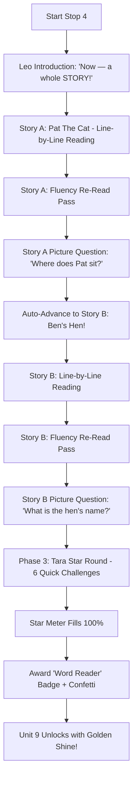

# Unit 8 Stop 4 — Story Time + Star Round: Setup Guide

## 1. Overview & Pedagogical Purpose

* **Activity Name:** Stop 4 — Story Time + Star Round (Unit 8)
* **Goal:** Read *Pat The Cat* (Session A) and *Ben's Hen* (Session B) with interactive audio support — followed by a 2-question picture comprehension check and Tara's 6-challenge Star Round that awards the **"Word Reader"** badge and unlocks **Unit 9**.
* **Core Rationale:** Every phonics drill and blend activity so far has led to this milestone. Stories give letter sounds a purpose and create the moment where a child proudly tells their parent: *"I read a real story!"*
* **3-Second Support Rule:** A child should never stay stuck for more than 3 seconds. Tapping any individual word pronounces it; tapping the speaker button reads the full line; and tapping the tick advances smoothly.

---

## 2. Activity Flow



---

## 3. Story Content & Phases Breakdown

### 📖 Story A: *Pat The Cat*
1. `I have a cat.`
2. `His name is Pat.`
3. `Pat will not play or run.`
4. `He sits on a mat.`
5. `Pat the cat is too fat.`

### 📖 Story B: *Ben's Hen*
1. `Ben got a new red hen.`
2. `Her name is Jen.`
3. `Jen, the hen, likes Ben.`
4. `Jen had ten eggs for Ben.`
5. `Ben is happy with Jen.`

### ❓ Picture Comprehension Questions
* **Question 1:** *"Where does Pat sit?"*  
  * Choices (Picture + Text): `on a mat` (Correct) | `on a bed` | `in a box`
* **Question 2:** *"What is the hen's name?"*  
  * Choices (Picture + Text): `Jen` (Correct) | `Ben` | `Pat`

### ⭐ Tara's 6 Star Round Challenges
1. **Challenge 1 (Blend Word):** *"Blend it — m, a, p."* ➔ `map`
2. **Challenge 2 (Change Letter):** *"Change 'cat' to 'bat'."* ➔ `bat`
3. **Challenge 3 (Identify Word):** *"Which word says 'hat'?"* ➔ `hat`
4. **Challenge 4 (Read Sentence):** *"Read this: 'The rat ran.'"* ➔ `The rat ran.`
5. **Challenge 5 (Sight Word Pocket):** *"Tap 'the' in your pocket."* ➔ `the`
6. **Challenge 6 (Final Blend):** *"Blend it — b, e, d."* ➔ `bed`

---

## 4. Unity UI & Hierarchy Setup

Create the following hierarchy under your UI Canvas:

```text
Canvas (or Unit8_UIPanel)
└── [Panel] Stop4_StoryTime                      <-- StoryTimeController, CanvasGroup, RectTransform (Stretch All)
    │
    ├── [Image] Background                        <-- Background scene sprite (Stretch All)
    │
    ├── [Empty] TopBar                            <-- RectTransform (Top Stretch, H: 120, Y: -60)
    │   ├── [Image] ProgressRingBackground        <-- Circular background (100x100)
    │   │   └── [Image] ProgressRingFill          <-- Image (Filled: Radial 360, Color: Emerald)
    │   ├── [TMP] ProgressText                    <-- TextMeshProUGUI ("0%")
    │   └── [Rect] StarMeter                      <-- Star meter rect with star icons
    │
    ├── [Empty] MascotArea                        <-- RectTransform (Bottom-Left: 300x380)
    │   ├── [Image] LeoMascot                     <-- Leo companion mascot (Active in Phases 1, 2, 4)
    │   └── [Image] TaraMascot                    <-- Tara tiger mascot (Active in Phase 3: Star Round)
    │
    ├── [Panel] StoryPanel                        <-- Phase 1 & 2: Story Reading Container (Center: 1200x650)
    │   ├── [TMP] StoryTitleTMP                   <-- TextMeshProUGUI ("Pat The Cat" / "Ben's Hen")
    │   ├── [Image] StoryIllustration             <-- Large story art (Pat on mat / Ben with hen & eggs)
    │   ├── [Panel] LineReadingArea               <-- Large print reading box (Pos Y: -180, Size: 1100x140)
    │   │   ├── [TMP] CurrentLineTMP              <-- Full line text fallback
    │   │   └── [Empty] WordsContainer            <-- HorizontalLayoutGroup (8 Word Slots)
    │   │       ├── [Button] Word_0               <-- Button + TMP + Highlight Image
    │   │       ├── [Button] Word_1
    │   │       ├── [Button] Word_2
    │   │       ├── [Button] Word_3
    │   │       ├── [Button] Word_4
    │   │       ├── [Button] Word_5
    │   │       ├── [Button] Word_6
    │   │       └── [Button] Word_7
    │   ├── [Button] ReadLineSpeakerButton        <-- Button with speaker icon (Reads full line)
    │   └── [Button] NextLineTickButton           <-- Green circle Button with white checkmark (✔)
    │
    ├── [Panel] ComprehensionPanel                <-- Phase 2: Picture Questions (Center: 1100x550, Inactive)
    │   ├── [TMP] QuestionPromptTMP               <-- "Where does Pat sit?" (Font Size: 40)
    │   └── [Empty] ChoicesContainer              <-- HorizontalLayoutGroup (Spacing: 40)
    │       ├── [Button] Choice_0                 <-- Card Button + Image (Illustration) + TMP (Label)
    │       ├── [Button] Choice_1
    │       └── [Button] Choice_2
    │
    ├── [Panel] StarRoundPanel                    <-- Phase 3: Tara Star Challenges (Center: 1100x550, Inactive)
    │   ├── [TMP] StarChallengePromptTMP          <-- "Blend it — m, a, p." (Font Size: 44)
    │   ├── [Button] ReplayStarAudioButton        <-- Audio repeat button
    │   ├── [Empty] StarChoicesContainer          <-- HorizontalLayoutGroup (3 Big choice tiles)
    │   │   ├── [Button] StarChoice_0             <-- Button + TMP
    │   │   ├── [Button] StarChoice_1
    │   │   └── [Button] StarChoice_2
    │   └── [Button] StartStarRoundButton         <-- Tara intro "Ready? Roar!" launch button
    │
    ├── [Panel] DialogueUI                        <-- CanvasGroup, DialogueBoxAutoHider (Bottom Center: 960x110)
    │   ├── [Image] DialogueBubbleBackground      <-- Speech bubble image
    │   └── [TMP] DialogueTMP                     <-- TextMeshProUGUI (Subtitle)
    │
    ├── [Empty] AudioManagers                     <-- Audio Sources
    │   ├── [AudioSource] VoiceAudioSource        <-- 2D AudioSource (Voice clips)
    │   └── [AudioSource] SFXAudioSource          <-- 2D AudioSource (SFX clips)
    │
    └── [Panel] RewardsContainer                  <-- Unlock Popups & Navigation
        ├── [Particle] ConfettiParticles          <-- ParticleSystem / UI Confetti
        ├── [Panel] RewardPopup                   <-- Stars completion popup
        ├── [Panel] StickerPopup                  <-- Story sticker popup
        ├── [Panel] BadgePopup                    <-- "Word Reader" Badge unlock modal
        ├── [Panel] Unit9UnlockPopup              <-- Golden Unit 9 Unlocked banner
        └── [Button] ContinueButton               <-- Transition button to Unit 9 map
```

---

## 5. Inspector Wire-Up Table (`StoryTimeController`)

| Inspector Field | Assigned GameObject / Asset |
| :--- | :--- |
| **Unit ID** | `"Unit8"` |
| **Topic Name** | `"StoryTime"` |
| **Active Story Index** | `0` (Story A: *Pat The Cat*) or `1` (Story B: *Ben's Hen*) |
| **Activity Data** | `Assets/Resources/Phonics2/Unit8/StoryTimeData_Unit8.asset` |
| **Voice Audio Source** | `AudioManagers/VoiceAudioSource` |
| **SFX Audio Source** | `AudioManagers/SFXAudioSource` |
| **Dialogue Text** | `DialogueUI/DialogueTMP` |
| **Dialogue Canvas Group** | `DialogueUI` |
| **Story Panel** | `StoryPanel` |
| **Story Title TMP** | `StoryPanel/StoryTitleTMP` |
| **Story Illustration Image** | `StoryPanel/StoryIllustration` |
| **Current Line TMP** | `StoryPanel/LineReadingArea/CurrentLineTMP` |
| **Word Buttons In Line (0..7)** | `StoryPanel/LineReadingArea/WordsContainer/Word_0` ... `Word_7` |
| **Word Texts In Line (0..7)** | `StoryPanel/LineReadingArea/WordsContainer/Word_0/TMP` ... `Word_7/TMP` |
| **Word Highlights In Line (0..7)** | `StoryPanel/LineReadingArea/WordsContainer/Word_0/Highlight` ... `Word_7/Highlight` |
| **Read Line Speaker Button** | `StoryPanel/ReadLineSpeakerButton` |
| **Next Line Tick Button** | `StoryPanel/NextLineTickButton` |
| **Comprehension Panel** | `ComprehensionPanel` |
| **Question Prompt TMP** | `ComprehensionPanel/QuestionPromptTMP` |
| **Question Choice Buttons (0..2)** | `ComprehensionPanel/ChoicesContainer/Choice_0` ... `Choice_2` |
| **Question Choice Texts (0..2)** | `ComprehensionPanel/ChoicesContainer/Choice_0/TMP` ... `Choice_2/TMP` |
| **Question Choice Images (0..2)** | `ComprehensionPanel/ChoicesContainer/Choice_0/Image` ... `Choice_2/Image` |
| **Star Round Panel** | `StarRoundPanel` |
| **Star Challenge Prompt TMP** | `StarRoundPanel/StarChallengePromptTMP` |
| **Star Choice Buttons (0..2)** | `StarRoundPanel/StarChoicesContainer/StarChoice_0` ... `StarChoice_2` |
| **Star Choice Texts (0..2)** | `StarRoundPanel/StarChoicesContainer/StarChoice_0/TMP` ... `StarChoice_2/TMP` |
| **Replay Star Audio Button** | `StarRoundPanel/ReplayStarAudioButton` |
| **Start Star Round Button** | `StarRoundPanel/StartStarRoundButton` |
| **Progress Ring Fill Image** | `TopBar/ProgressRingBackground/ProgressRingFill` |
| **Progress Text** | `TopBar/ProgressText` |
| **Star Meter Rect** | `TopBar/StarMeter` |
| **Leo Mascot Object** | `MascotArea/LeoMascot` |
| **Tara Mascot Object** | `MascotArea/TaraMascot` |
| **Confetti Particles** | `RewardsContainer/ConfettiParticles` |
| **Reward Popup** | `RewardsContainer/RewardPopup` |
| **Sticker Popup** | `RewardsContainer/StickerPopup` |
| **Badge Popup** | `RewardsContainer/BadgePopup` |
| **Unit 9 Unlock Popup** | `RewardsContainer/Unit9UnlockPopup` |
| **Continue Button** | `RewardsContainer/ContinueButton` |

---

## 6. ScriptableObject Configuration (`StoryTimeData`)

Generate the asset automatically using the Unity menu:  
**`EngSnap > Phonics2 > Create Story Time Data (Unit 8 Stop 4)`**

The asset is placed at:  
`Assets/Resources/Phonics2/Unit8/StoryTimeData_Unit8.asset`

---

## 7. Voice & Sound Script Manifest (For AI Voice Generator)

| Asset Filename | Voice / Role | Script / Transcript | Purpose & Context |
| :--- | :--- | :--- | :--- |
| `leo_u8s4_intro.wav` | **Leo** | *"You can read words. You can read sentences. Now — a whole STORY."* | Warm, enthusiastic opening line. |
| `leo_u8s4_permission.wav` | **Leo** | *"Read it your way. Tap any word you want to hear."* | Permission line that removes all pressure. |
| `story_a_line_1.wav` | Story A | *"I have a cat."* | Natural reading pace. |
| `story_a_line_2.wav` | Story A | *"His name is Pat."* | Natural reading pace. |
| `story_a_line_3.wav` | Story A | *"Pat will not play or run."* | Natural reading pace. |
| `story_a_line_4.wav` | Story A | *"He sits on a mat."* | Natural reading pace. |
| `story_a_line_5.wav` | Story A | *"Pat the cat is too fat."* | Natural reading pace. |
| `story_a_full.wav` | Story A | *(Entire 5-line story read as continuous flowing narration)* | Used for fluency re-read pass. |
| `story_b_line_1.wav` | Story B | *"Ben got a new red hen."* | Natural reading pace. |
| `story_b_line_2.wav` | Story B | *"Her name is Jen."* | Natural reading pace. |
| `story_b_line_3.wav` | Story B | *"Jen, the hen, likes Ben."* | Natural reading pace. |
| `story_b_line_4.wav` | Story B | *"Jen had ten eggs for Ben."* | Natural reading pace. |
| `story_b_line_5.wav` | Story B | *"Ben is happy with Jen."* | Natural reading pace. |
| `story_b_full.wav` | Story B | *(Entire 5-line story read as continuous flowing narration)* | Used for fluency re-read pass. |
| `leo_u8s4_reread.wav` | **Leo** | *"You read the whole story! Shall we read it again, faster this time?"* | Fluency re-read invitation. |
| `leo_u8s4_q1.wav` | **Leo** | *"Where does Pat sit? Tap the picture."* | Comprehension Question 1. |
| `leo_u8s4_q2.wav` | **Leo** | *"What is the hen's name? Tap the picture."* | Comprehension Question 2. |
| `tara_u8s4_intro.wav` | **Tara** | *"My turn! Six quick challenges. Ready? Roar!"* | Energetic, playful Star Round intro. |
| `tara_u8s4_c1.wav` | **Tara** | *"Blend it — m, a, p."* | Challenge 1. |
| `tara_u8s4_c2.wav` | **Tara** | *"Change 'cat' to 'bat'."* | Challenge 2. |
| `tara_u8s4_c3.wav` | **Tara** | *"Which word says 'hat'?"* | Challenge 3. |
| `tara_u8s4_c4.wav` | **Tara** | *"Read this: The rat ran."* | Challenge 4. |
| `tara_u8s4_c5.wav` | **Tara** | *"Tap 'the' in your pocket."* | Challenge 5. |
| `tara_u8s4_c6.wav` | **Tara** | *"Blend it — b, e, d."* | Challenge 6. |
| `leo_u8s4_badge.wav` | **Leo** | *"You are a WORD READER! Go and read that story to someone at home."* | Major achievement badge moment. |
| `leo_u8s4_unlock.wav` | **Leo** | *"Unit Nine is open! Next time — i, o and u, and three more stories."* | Final unit completion hook. |

---

## 8. Required Visual Assets

1. **Story Illustrations:**
   * `pat_the_cat_scene.png` — Chubby orange/tabby cat Pat sitting comfortably on a welcome mat.
   * `bens_hen_scene.png` — Boy Ben with smiling red hen Jen and a nest holding 10 speckled eggs.
2. **Comprehension Choice Badges:**
   * `choice_mat.png` — Welcome mat.
   * `choice_bed.png` — Cozy bed.
   * `choice_box.png` — Cardboard box.
   * `choice_jen.png` — Red hen avatar.
   * `choice_ben.png` — Boy Ben avatar.
   * `choice_pat.png` — Fat cat Pat avatar.
3. **Reward Badges & Popups:**
   * `badge_word_reader.png` — An open storybook adorned with 3 golden letter tiles (`C`, `A`, `T`).
   * `unit9_unlocked_banner.png` — Glowing ribbon / golden sign for Unit 9 (*Vowel Valley: i, o, u*).

---

## 9. Verification & QA Checklist

- [ ] **Line-by-Line Reading:** Does tapping any word trigger its sound clip? Does tapping the speaker play the entire line?
- [ ] **Tick Navigation:** Does tapping the checkmark (✔) smoothly advance to the next story line?
- [ ] **Fluency Re-read Pass:** After line 5, does the story replay as a whole unit with flowing word-by-word highlight?
- [ ] **Picture Comprehension:** Do the 2 picture questions load with 3 visual choices and provide gentle retry feedback if an incorrect choice is tapped?
- [ ] **Tara Star Round:** Does Tara's mascot appear, transition through all 6 challenges, and animate the star meter on each correct answer?
- [ ] **Badge & Unit 9 Unlock:** Does the "Word Reader" badge popup appear with confetti, followed by Leo announcing the Unit 9 unlock before returning to the unit map?
