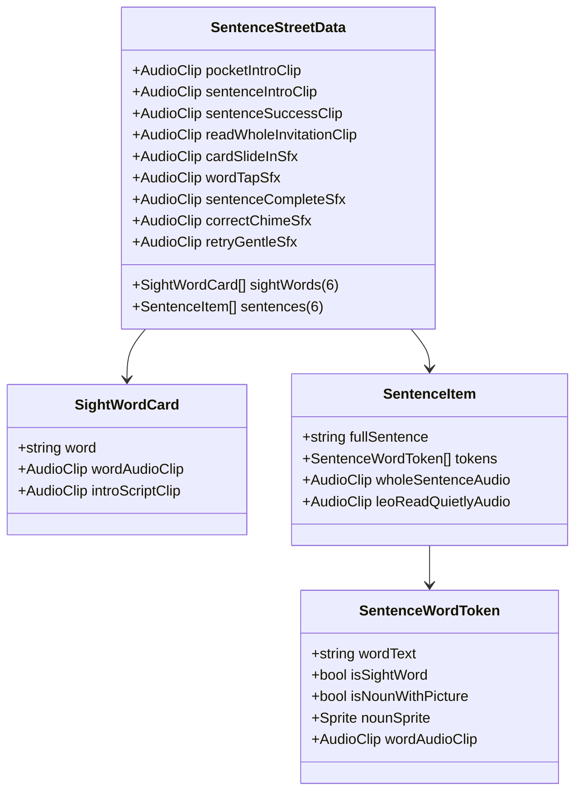

# Unit 9 Stop 3 — Sentence Street: ScriptableObject Data Setup Guide

This guide details the complete data configuration for **Unit 9 Stop 3 (Sentence Street)**, built with the exact data architecture of Unit 8 Stop 3.

---

## 1. Quick One-Click Asset Generation

You can automatically generate and populate the complete data asset using Unity's top menu bar:

> **Unity Menu:** `EngSnap > Phonics2 > Create Sentence Street Data (Unit 9 Stop 3)`

This generates the initialized `.asset` file at both:
1. **Runtime Resources Path:** `Assets/Resources/Phonics2/Unit9/SentenceStreetData_Unit9.asset`
2. **Project Asset Path:** `Assets/ScriptableObj/Phonics 2/Unit 9/Sentence Street/SentenceStreetData_Unit9.asset`

*(Note: The controller automatically falls back to `Resources.Load<SentenceStreetData>("Phonics2/Unit9/SentenceStreetData_Unit9")` if the inspector field is unassigned.)*

---

## 2. Data Schema Architecture

---

## 3. Section-by-Section Data Configuration

### A. 6 Sight Words (`sightWords`)

| Index | Word | Voice Clip | Leo Intro Script |
| :---: | :--- | :--- | :--- |
| **`[0]`** | `"he"` | `sw_he.wav` | *"This one says 'he'. Pop it in your pocket!"* |
| **`[1]`** | `"she"` | `sw_she.wav` | *"This one says 'she'. Pop it in your pocket!"* |
| **`[2]`** | `"his"` | `sw_his.wav` | *"This one says 'his'. Pop it in your pocket!"* |
| **`[3]`** | `"her"` | `sw_her.wav` | *"This one says 'her'. Pop it in your pocket!"* |
| **`[4]`** | `"was"` | `sw_was.wav` | *"This one says 'was'. Pop it in your pocket!"* |
| **`[5]`** | `"with"` | `sw_with.wav` | *"This one says 'with'. Pop it in your pocket!"* |

---

### B. 6 Book Sentences Token Breakdown (`sentences`)

#### 1. `"The fig is in the bin."`
* **Whole Audio:** `sent_u9_1_whole.wav`
* **Tokens (6 words):**

| # | `wordText` | `isSightWord` | `isNounWithPicture` | `nounSprite` | `wordAudioClip` |
| :-: | :--- | :---: | :---: | :--- | :--- |
| `0` | `"The"` | `true` | `false` | *None* | `sw_the.wav` |
| `1` | `"fig"` | `false` | **`true`** | `fig.png` | `word_fig.wav` |
| `2` | `"is"` | `true` | `false` | *None* | `sw_is.wav` |
| `3` | `"in"` | `true` | `false` | *None* | `word_in.wav` |
| `4` | `"the"` | `true` | `false` | *None* | `sw_the.wav` |
| `5` | `"bin."` | `false` | **`true`** | `bin.png` | `word_bin.wav` |

---

#### 2. `"The kid with a wig sat in a pit."`
* **Whole Audio:** `sent_u9_2_whole.wav`
* **Tokens (9 words):**

| # | `wordText` | `isSightWord` | `isNounWithPicture` | `nounSprite` | `wordAudioClip` |
| :-: | :--- | :---: | :---: | :--- | :--- |
| `0` | `"The"` | `true` | `false` | *None* | `sw_the.wav` |
| `1` | `"kid"` | `false` | **`true`** | `kid.png` | `word_kid.wav` |
| `2` | `"with"` | `true` | `false` | *None* | `sw_with.wav` |
| `3` | `"a"` | `true` | `false` | *None* | `sw_a.wav` |
| `4` | `"wig"` | `false` | **`true`** | `wig.png` | `word_wig.wav` |
| `5` | `"sat"` | `false` | `false` | *None* | `word_sat.wav` |
| `6` | `"in"` | `true` | `false` | *None* | `word_in.wav` |
| `7` | `"a"` | `true` | `false` | *None* | `sw_a.wav` |
| `8` | `"pit."` | `false` | **`true`** | `pit.png` | `word_pit.wav` |

---

#### 3. `"This is a dog and its name is Tom."`
* **Whole Audio:** `sent_u9_3_whole.wav`
* **Tokens (9 words):**

| # | `wordText` | `isSightWord` | `isNounWithPicture` | `nounSprite` | `wordAudioClip` |
| :-: | :--- | :---: | :---: | :--- | :--- |
| `0` | `"This"` | `true` | `false` | *None* | `sw_this.wav` |
| `1` | `"is"` | `true` | `false` | *None* | `sw_is.wav` |
| `2` | `"a"` | `true` | `false` | *None* | `sw_a.wav` |
| `3` | `"dog"` | `false` | **`true`** | `dog.png` | `word_dog.wav` |
| `4` | `"and"` | `true` | `false` | *None* | `sw_and.wav` |
| `5` | `"its"` | `true` | `false` | *None* | `sw_its.wav` |
| `6` | `"name"` | `true` | `false` | *None* | `sw_name.wav` |
| `7` | `"is"` | `true` | `false` | *None* | `sw_is.wav` |
| `8` | `"Tom."` | `false` | **`true`** | `tom.png` | `word_tom.wav` |

---

#### 4. `"A fox sat on a log."`
* **Whole Audio:** `sent_u9_4_whole.wav`
* **Tokens (6 words):**

| # | `wordText` | `isSightWord` | `isNounWithPicture` | `nounSprite` | `wordAudioClip` |
| :-: | :--- | :---: | :---: | :--- | :--- |
| `0` | `"A"` | `true` | `false` | *None* | `sw_a.wav` |
| `1` | `"fox"` | `false` | **`true`** | `fox.png` | `word_fox.wav` |
| `2` | `"sat"` | `false` | `false` | *None* | `word_sat.wav` |
| `3` | `"on"` | `true` | `false` | *None* | `word_on.wav` |
| `4` | `"a"` | `true` | `false` | *None* | `sw_a.wav` |
| `5` | `"log."` | `false` | **`true`** | `log.png` | `word_log.wav` |

---

#### 5. `"The cub rubs the pup."`
* **Whole Audio:** `sent_u9_5_whole.wav`
* **Tokens (5 words):**

| # | `wordText` | `isSightWord` | `isNounWithPicture` | `nounSprite` | `wordAudioClip` |
| :-: | :--- | :---: | :---: | :--- | :--- |
| `0` | `"The"` | `true` | `false` | *None* | `sw_the.wav` |
| `1` | `"cub"` | `false` | **`true`** | `cub.png` | `word_cub.wav` |
| `2` | `"rubs"` | `false` | `false` | *None* | `word_rubs.wav` |
| `3` | `"the"` | `true` | `false` | *None* | `sw_the.wav` |
| `4` | `"pup."` | `false` | **`true`** | `pup.png` | `word_pup.wav` |

---

#### 6. `"The pup is in the tub."`
* **Whole Audio:** `sent_u9_6_whole.wav`
* **Tokens (6 words):**

| # | `wordText` | `isSightWord` | `isNounWithPicture` | `nounSprite` | `wordAudioClip` |
| :-: | :--- | :---: | :---: | :--- | :--- |
| `0` | `"The"` | `true` | `false` | *None* | `sw_the.wav` |
| `1` | `"pup"` | `false` | **`true`** | `pup.png` | `word_pup.wav` |
| `2` | `"is"` | `true` | `false` | *None* | `sw_is.wav` |
| `3` | `"in"` | `true` | `false` | *None* | `word_in.wav` |
| `4` | `"the"` | `true` | `false` | *None* | `sw_the.wav` |
| `5` | `"tub."` | `false` | **`true`** | `tub.png` | `word_tub.wav` |

---

### C. Audio Clips Reference Matrix

| Field in Asset | Asset File | Purpose / Role |
| :--- | :--- | :--- |
| **`pocketIntroClip`** | `leo_u9s3_pocket_intro.wav` | Leo: *"Six more pocket words today. These ones you just know — no sounding out!"* |
| **`sentenceIntroClip`** | `leo_u9s3_sentence_intro.wav` | Leo: *"Here comes your first sentence. Tap each word and read it!"* |
| **`readWholeInvitationClip`**| `leo_u9s3_read_whole_invitation.wav` | Leo: *"Now let us read it all together, nice and smooth."* |
| **`sentenceSuccessClip`** | `leo_u9s3_sentence_success.wav`| Leo: *"You read a SENTENCE. A whole sentence, by yourself!"* |
| **`cardSlideInSfx`** | `card_slide.wav` | Card entry SFX |
| **`wordTapSfx`** | `pop_tap.wav` | Word tap click sound |
| **`sentenceCompleteSfx`** | `chime_twinkle.wav` | Line reading complete chime |
| **`correctChimeSfx`** | `success_fanfare.wav` | Correct chime sound |
| **`retryGentleSfx`** | `gentle_retry.wav` | Gentle retry sound |
