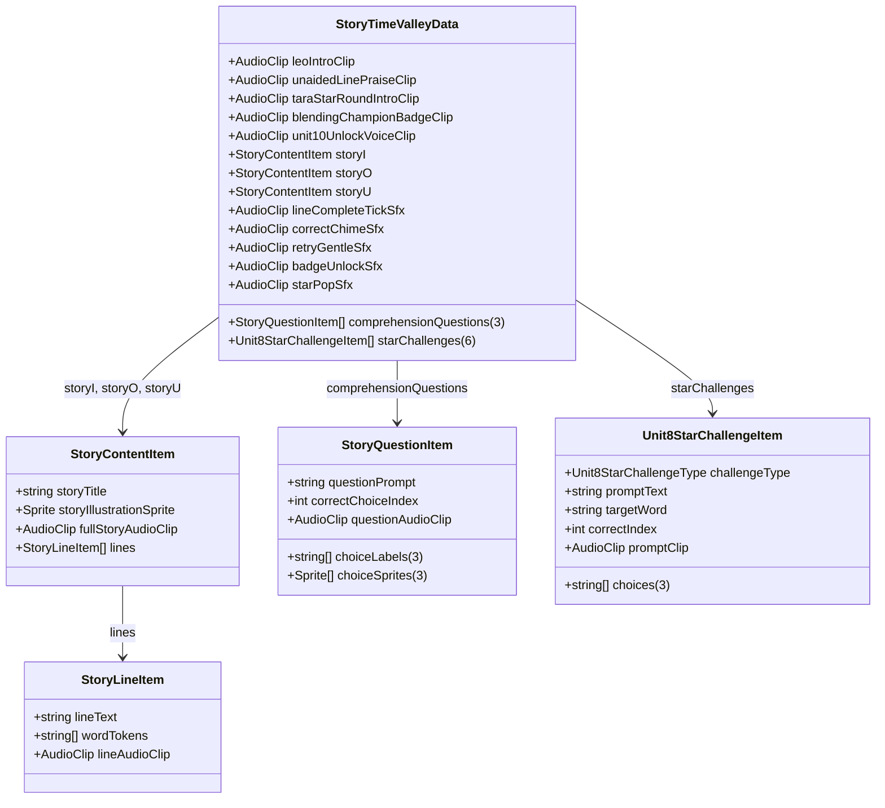

# Unit 9 Stop 4 — Story Time + Star Round: ScriptableObject Data Setup Guide

This guide details the complete data configuration for **Unit 9 Stop 4 (Story Time + Star Round)**, including asset generation, data schema, story line tokenization, comprehension questions, Tara Star Round challenges, and audio slot mappings.

---

## 1. Quick One-Click Asset Generation

You can automatically generate and populate the complete data asset using Unity's top menu bar:

> **Unity Menu:** `EngSnap > Phonics2 > Create Story Time Valley Data (Unit 9 Stop 4)`

This generates the initialized `.asset` file at both:
1. **Runtime Resources Path:** `Assets/Resources/Phonics2/Unit9/StoryTimeValleyData_Unit9.asset`
2. **Project Asset Path:** `Assets/ScriptableObj/Phonics 2/Unit 9/Story Time/StoryTimeValleyData_Unit9.asset`

*(Note: [`StoryTimeValleyController`](file:///c:/EngSnap/EngSnap_Beginners_Phonics/EngSnap_Beginners_Phonics/Assets/Scripts/Phonics2/Unit_9/Stop4_StoryTime/StoryTimeValleyController.cs) automatically falls back to `Resources.Load<StoryTimeValleyData>("Phonics2/Unit9/StoryTimeValleyData_Unit9")` if the inspector field is unassigned.)*

---

## 2. Data Schema Architecture

---

## 3. Section-by-Section Data Breakdown

### A. Story i: *The Big Pig* (`storyI`)

* **`storyTitle`:** `"The Big Pig"`
* **`storyIllustrationSprite`:** `fig_the_pig_scene.png`
* **`fullStoryAudioClip`:** `story_i_full.wav`
* **Lines Breakdown (5 lines):**

| Line # | `lineText` | `wordTokens` | `lineAudioClip` |
| :---: | :--- | :--- | :--- |
| **1** | `"I have a pink pig."` | `["I", "have", "a", "pink", "pig."]` | `story_i_line_1.wav` |
| **2** | `"His name is Fig."` | `["His", "name", "is", "Fig."]` | `story_i_line_2.wav` |
| **3** | `"Fig the pig is big."` | `["Fig", "the", "pig", "is", "big."]` | `story_i_line_3.wav` |
| **4** | `"He likes to dig and do a jig."` | `["He", "likes", "to", "dig", "and", "do", "a", "jig."]` | `story_i_line_4.wav` |
| **5** | `"The big pig digs and jigs."` | `["The", "big", "pig", "digs", "and", "jigs."]` | `story_i_line_5.wav` |

---

### B. Story o: *Tom's Dog* (`storyO`)

* **`storyTitle`:** `"Tom's Dog"`
* **`storyIllustrationSprite`:** `toms_dog_scene.png`
* **`fullStoryAudioClip`:** `story_o_full.wav`
* **Lines Breakdown (4 lines):**

| Line # | `lineText` | `wordTokens` | `lineAudioClip` |
| :---: | :--- | :--- | :--- |
| **1** | `"Tom has a dog."` | `["Tom", "has", "a", "dog."]` | `story_o_line_1.wav` |
| **2** | `"The dog sat on the log."` | `["The", "dog", "sat", "on", "the", "log."]` | `story_o_line_2.wav` |
| **3** | `"The sun is hot so Tom did not sit on the log."` | `["The", "sun", "is", "hot", "so", "Tom", "did", "not", "sit", "on", "the", "log."]` | `story_o_line_3.wav` |
| **4** | `"Tom did sob."` | `["Tom", "did", "sob."]` | `story_o_line_4.wav` |

---

### C. Story u: *The Bug* (`storyU`)

* **`storyTitle`:** `"The Bug"`
* **`storyIllustrationSprite`:** `tim_and_the_bug_scene.png`
* **`fullStoryAudioClip`:** `story_u_full.wav`
* **Lines Breakdown (4 lines):**

| Line # | `lineText` | `wordTokens` | `lineAudioClip` |
| :---: | :--- | :--- | :--- |
| **1** | `"Tim has a funny bug."` | `["Tim", "has", "a", "funny", "bug."]` | `story_u_line_1.wav` |
| **2** | `"The bug likes to hug Tim and to sleep in a mug."` | `["The", "bug", "likes", "to", "hug", "Tim", "and", "to", "sleep", "in", "a", "mug."]` | `story_u_line_2.wav` |
| **3** | `"One day, the bug got stuck in a jug."` | `["One", "day,", "the", "bug", "got", "stuck", "in", "a", "jug."]` | `story_u_line_3.wav` |
| **4** | `"Tim dug the bug out of the jug."` | `["Tim", "dug", "the", "bug", "out", "of", "the", "jug."]` | `story_u_line_4.wav` |

---

### D. 3 Picture Comprehension Questions (`comprehensionQuestions`)

| Q # | `questionPrompt` | Choices (`choiceLabels`) | `correctChoiceIndex` | `questionAudioClip` | Choice Sprites |
| :---: | :--- | :--- | :---: | :--- | :--- |
| **`[0]`** | *"What is the pig's name?"* | `["Fig", "Big", "Jig"]` | **`0`** (`Fig`) | `leo_u9s4_q1.wav` | `choice_fig`, `choice_big`, `choice_jig` |
| **`[1]`** | *"Why did Tom not sit on the log?"* | `["The sun is hot", "The dog was there", "The log was wet"]` | **`0`** (`The sun is hot`) | `leo_u9s4_q2.wav` | `choice_sun_hot`, `choice_dog_there`, `choice_log_wet` |
| **`[2]`** | *"Where did the bug get stuck?"* | `["in a jug", "in a mug", "in a rug"]` | **`0`** (`in a jug`) | `leo_u9s4_q3.wav` | `choice_jug`, `choice_mug`, `choice_rug` |

---

### E. 6 Tara Star Round Challenges (`starChallenges`)

| Challenge # | Type (`challengeType`) | Prompt Text (`promptText`) | Target Word | Choices Array (`choices`) | Correct Index | Audio Prompt Clip (`promptClip`) |
| :---: | :--- | :--- | :--- | :--- | :---: | :--- |
| **`[0]`** | `BlendWord` | *"Blend it — f, o, x."* | `fox` | `["fox", "box", "fix"]` | **`0`** | `tara_u9s4_c1.wav` |
| **`[1]`** | `IdentifyWord` | *"Which is it — bag, big, or bug?"* | `big` | `["bag", "big", "bug"]` | **`1`** | `tara_u9s4_c2.wav` |
| **`[2]`** | `ChangeLetter` | *"Change 'pig' to 'pit'."* | `pit` | `["pit", "pin", "pot"]` | **`0`** | `tara_u9s4_c3.wav` |
| **`[3]`** | `ReadSentence` | *"Read this: 'The pup is in the tub.'"* | `The pup is in the tub.` | `["The pup is in the tub.", "The cub is in the tub.", "The pup is on the rug."]` | **`0`** | `tara_u9s4_c4.wav` |
| **`[4]`** | `PocketSightWord` | *"Tap 'with' in your pocket."* | `with` | `["with", "was", "she"]` | **`0`** | `tara_u9s4_c5.wav` |
| **`[5]`** | `ReadSentence` | *"Does this make sense — 'The log sat on the fox'?"* | `Silly!` | `["Silly!", "Yes, makes sense"]` | **`0`** | `tara_u9s4_c6.wav` |

---

### F. Voice & Sound SFX Matrix

| Field in Asset | Audio Filename | Role / Script |
| :--- | :--- | :--- |
| **`leoIntroClip`** | `leo_u9s4_intro.wav` | Leo: *"Three stories this time. Try each line by yourself first — I am right here if you need me."* |
| **`unaidedLinePraiseClip`** | `leo_u9s4_unaided_praise.wav` | Leo: *"You read that whole line without any help. Did you notice?"* |
| **`taraStarRoundIntroClip`** | `tara_u9s4_intro.wav` | Tara: *"My turn! Six quick challenges. Ready? Roar!"* |
| **`blendingChampionBadgeClip`** | `leo_u9s4_badge.wav` | Leo: *"Every vowel, every word. You are a BLENDING CHAMPION!"* |
| **`unit10UnlockVoiceClip`** | `leo_u9s4_unlock.wav` | Leo: *"Unit Ten is open — the last one. Next time you read a real story, all the way through, by yourself."* |
| **`lineCompleteTickSfx`** | `tick_pop.wav` | Checkmark tick button press SFX |
| **`correctChimeSfx`** | `success_fanfare.wav` | Correct answer / challenge success chime |
| **`retryGentleSfx`** | `gentle_retry.wav` | Gentle retry sound |
| **`badgeUnlockSfx`** | `badge_fanfare.wav` | Major badge unlock triumph fanfare |
| **`starPopSfx`** | `star_pop.wav` | Star meter bouncing pop SFX |

---

## 4. How to Switch Active Story in Inspector

In the Unity Inspector on `Stop4_StoryTime` (`StoryTimeValleyController`), set the **Active Story Index**:
* Set to **`0`** for Story i (*The Big Pig*)
* Set to **`1`** for Story o (*Tom's Dog*)
* Set to **`2`** for Story u (*The Bug*)
